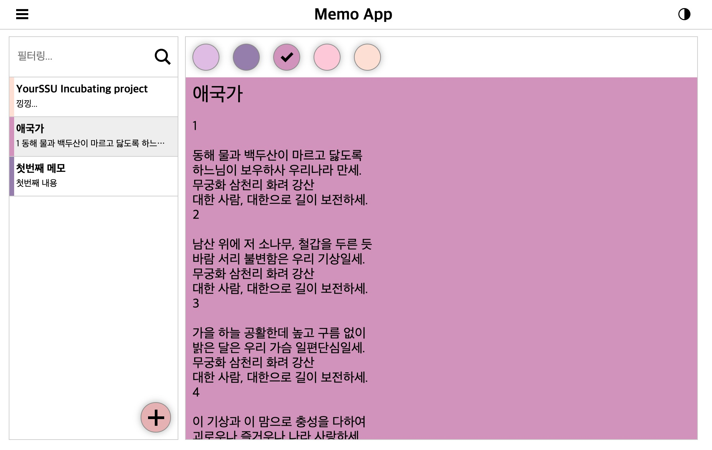
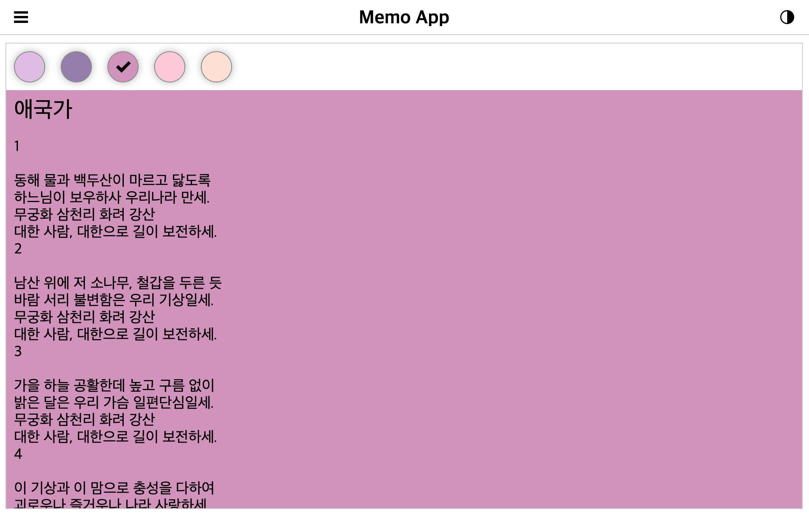
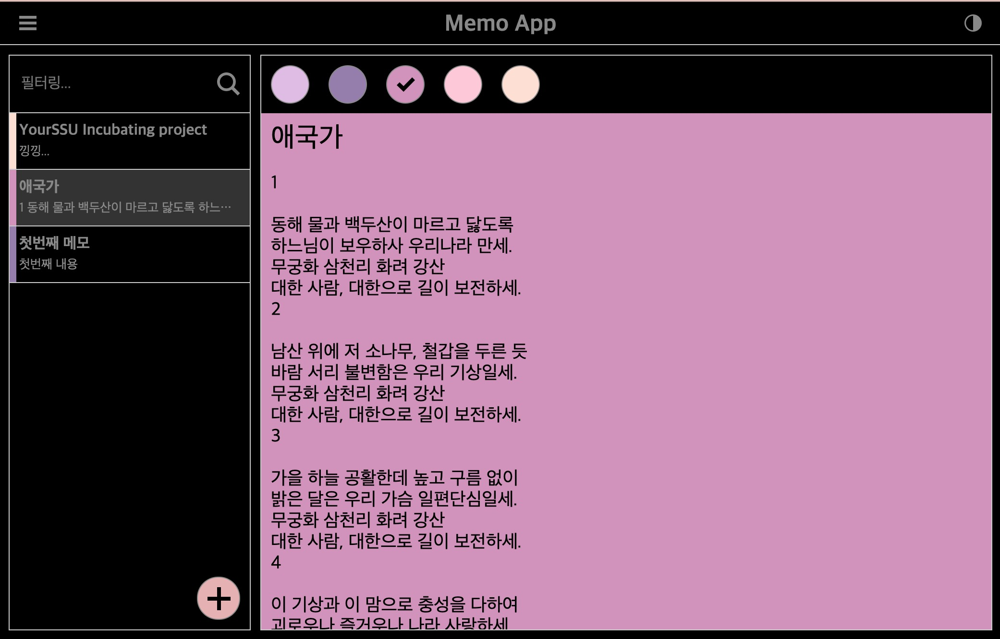

# 2020-2 YOURSSU Incubating 과제

## 결과페이지

https://vbalien.github.io/incubating-webfront-2020/

## 기한

4주(11월 10일 ~ 12월 8일)

## 진행 요구사항

gitlab의 `2020-2` 브랜치에서 `2020-02/이름` 이름으로 새로운 브랜치를 만들어서 진행.
완료시 `2020-2`브랜치로 Merge Request.

## 기능 요구사항

- 뼈대만 있는 컴포넌트들을 완성
- 컴포넌트의 모든 기능을 테스트 해볼 수 있도록 storybook을 작성
- emotion의 theming을 이용한 DarkMode 구현
- 사이드바 토글
- 메모 추가를 구현
- 메모 수정 및 자동 저장을 구현
- 메모 삭제를 구현
- 메모의 배경색을 5가지 선택 구현
- 메모 필터링
  - 메모의 제목과 내용에서 특정 내용을 필터링합니다.
  - 반드시 redux사용하세요!
- React-Router를 사용하여 각 메모를 주소를 이용해 액세스 할 수 있도록 구현

## 프로그래밍 요구사항

- 모든 스타일은 emotion을 사용하도록 합니다.
- 상태관리는 Redux + Redux ToolKit을 이용합니다.
- 메모와 상태값은 IndexedDB 혹은 localStorage에 저장되어 다음 접속시 불러오도록 합니다.
  - 저장 형식은 자유롭게 하시면 됩니다.
- 프로젝트에 설정된 eslint규칙을 최대한 지켜주세요. 적어도 eslint오류는 나면 안됩니다.
- 레이아웃은 css의 flexbox를 사용합니다.
- 필요에 따라 component를 추가 혹은 삭제 할 수 있습니다.
  - 추가 할 경우 해당 컴포넌트의 storybook은 반드시 작성해야 합니다.
  - 기존 컴포넌트의 props 추가/삭제는 자유입니다.
- 필요에 따라 svg아이콘을 추가하여 사용합니다.
  - 무료 아이콘: https://iconmonstr.com/
- 요구사항만 만족할 경우 외부 라이브러리 사용 가능

## 레이아웃 예시

> 이것은 레이아웃 배치와 과제 프로그램의 이해를 돕기 위한 예시일 뿐 자유롭게 디자인 하시기를 권장합니다.

### 기본



### 사이드바 가리기



### 다크모드



## 프로젝트 구조

구조는 변경하셔도 됩니다.

```sh
incubating-webfront
├── package.json
├── Readme.md
├── src
│   ├── App.tsx # 앱의 루트 컴포넌트
│   ├── components # 범용 컴포넌트는 이곳에 위치
│   │   ├── Button.stories.tsx # Button storybook
│   │   ├── Button.tsx # Button component
│   │   ├── Header.stories.tsx # 상단영역 storybook
│   │   ├── Header.tsx # 상단영역 component
│   │   ├── Icon # Icon component
│   │   │   ├── Icon.stories.tsx # Icon storybook
│   │   │   ├── Icon.tsx # Icon component
│   │   │   └── svg # 아이콘 SVG 파일은 이곳에 위치
│   │   │       ├── index.ts
│   │   │       ├── pen.svg
│   │   │       ├── plus.svg
│   │   │       └── search.svg
│   │   ├── index.ts # export를 위한 index 파일
│   │   ├── MemoList.stories.tsx # 메모 목록 storybook
│   │   ├── MemoList.tsx # 메모 목록 component
│   │   ├── Memo.stories.tsx # 메모작성/수정/보기 storybook
│   │   ├── Memo.tsx # 메모작성/수정/보기 component
│   ├── hooks # custom hook을 사용할 경우 이곳에 위치
│   ├── index.hbs # HTML entry point
│   ├── index.tsx # JavaScript entry point
│   ├── typing.d.ts # typing
│   └── utils # 유틸리티 함수는 이곳에 위치
├── tsconfig-for-webpack-config.json # webpack 구성파일의 타입스크립트 설정
├── tsconfig.json # 타입스크립트 설정
├── webpack.common.ts # 범용 빌드 구성
├── webpack.dev.ts # 개발모드 빌드 구성
├── webpack.prod.ts # 배포모드 빌드 구성
└── yarn.lock # lock file
```
